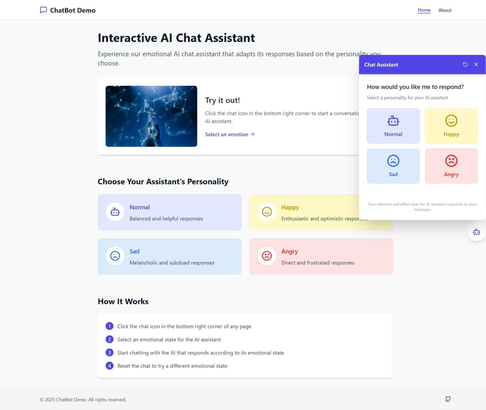

# <div align="center">🤖 Floating Emotional AI Chat Bot</div>

<div align="center">
  
  
  
</div>

<div align="center">
  <em>An interactive AI assistant that adapts its personality based on emotional states</em>
</div>

<br>

<div style="display: flex; justify-content: center; margin: 20px 0;">
  
</div>

## 📌 Table of Contents

<!-- TOC -->

- [✨ Features](#-features)
- [🚀 Quick Start](#-quick-start)
- [🛠 Technologies](#-technologies)
- [💡 Usage](#-usage)
- [📎 Configuration](#-configuration)
- [📬 Contact](#-contact)

<!-- /TOC -->

## ✨ Features

<div style="background: #f8f9fa; padding: 20px; border-radius: 8px; margin: 15px 0;">
  <div style="display: grid; grid-template-columns: repeat(auto-fit, minmax(250px, 1fr)); gap: 15px;">
    <div style="background: white; padding: 15px; border-radius: 6px; box-shadow: 0 2px 4px rgba(0,0,0,0.05);">
      <h4>🎭 Emotional States</h4>
      <p>Choose from Happy, Sad, Angry or Normal personalities</p>
    </div>
    <div style="background: white; padding: 15px; border-radius: 6px; box-shadow: 0 2px 4px rgba(0,0,0,0.05);">
      <h4>🔒 Privacy Focused</h4>
      <p>All conversations stored locally in your browser</p>
    </div>
    <div style="background: white; padding: 15px; border-radius: 6px; box-shadow: 0 2px 4px rgba(0,0,0,0.05);">
      <h4>🤖 Gemini AI</h4>
      <p>Powered by Google's cutting-edge language model</p>
    </div>
    <div style="background: white; padding: 15px; border-radius: 6px; box-shadow: 0 2px 4px rgba(0,0,0,0.05);">
      <h4>🎨 Beautiful UI</h4>
      <p>Smooth animations and responsive design</p>
    </div>
  </div>
</div>

## 🚀 Quick Start

### Prerequisites

- Node.js ≥18.x
- npm ≥9.x
- Google API Key

### Installation

```bash
# Clone the repository
git clone https://github.com/Anurag-Shankar-Maurya/WebBot
cd WebBot

# Install dependencies
npm install

# Set up environment variables
echo "VITE_GEMINI_API_KEY=your_api_key" > .env

# Start development server
npm run dev
```

## 🛠 Technologies

<div style="display: flex; flex-wrap: wrap; gap: 10px; margin: 15px 0;">
  <div style="background: #e3f2fd; padding: 8px 12px; border-radius: 20px; font-size: 0.9em;">React</div>
  <div style="background: #e8f5e9; padding: 8px 12px; border-radius: 20px; font-size: 0.9em;">TypeScript</div>
  <div style="background: #f3e5f5; padding: 8px 12px; border-radius: 20px; font-size: 0.9em;">Vite</div>
  <div style="background: #fff8e1; padding: 8px 12px; border-radius: 20px; font-size: 0.9em;">Tailwind CSS</div>
  <div style="background: #e0f7fa; padding: 8px 12px; border-radius: 20px; font-size: 0.9em;">Framer Motion</div>
  <div style="background: #f1f8e9; padding: 8px 12px; border-radius: 20px; font-size: 0.9em;">Gemini AI</div>
</div>

## 💡 Usage

1. Click the floating chat icon (bottom-right corner)
2. Select an emotional state:
    - 😊 Happy
    - 😢 Sad
    - 😠 Angry
    - 😐 Normal
3. Begin your conversation
4. The AI will adapt responses to your selected emotion

```javascript
// Example emotion configuration
const emotions = {
  happy: "Respond enthusiastically with positive language",
  sad: "Show empathy and use comforting words",
  angry: "Keep responses short and direct",
  normal: "Neutral, professional tone"
};
```

## ⚙ Configuration

Environment variables (`.env` file):

```ini
VITE_GEMINI_API_KEY=your_google_api_key
```

## 📬 Contact

### Anurag Shankar Maurya

Email : [anuragshankarmaurya@gmail.com](anuragshankarmaurya@gmail.com)

Project Link: [https://github.com/Anurag-Shankar-Maurya/WebBot](https://github.com/Anurag-Shankar-Maurya/WebBot)

---

<div align="center">
  Made with ❤️ and ☕ by Anurag Shankar Maurya
</div>